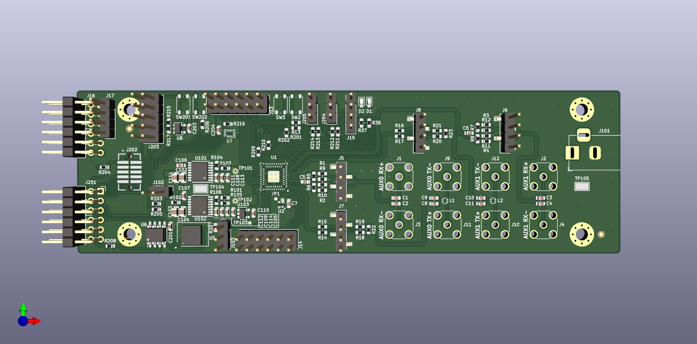
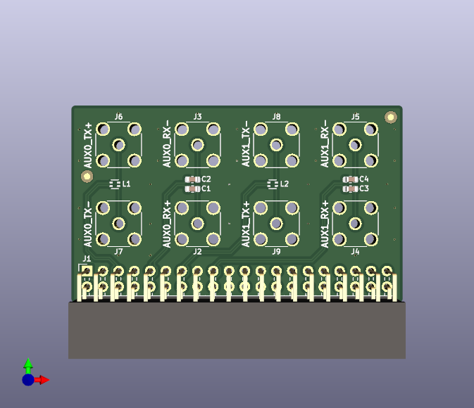

# hw-ignitionlet
Breakout board for the ice40 FPGA with SPI PMOD interface

# Bonus boards
There is a lvds_sma_adaptor included which breaks out the LVDS pairs
with a compatible pinout to the [Lattice ECP5 Dev Kit](https://www.latticesemi.com/products/developmentboardsandkits/ecp5evaluationboard)

# Status
No known required rework. See schematic notes for required
jumper settings.